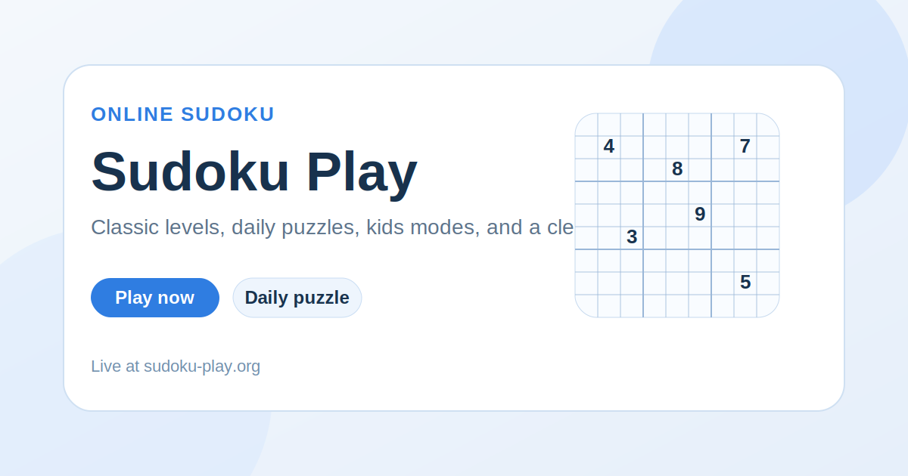

  

<h1 align="center">Sudoku Play</h1>

  Fast online Sudoku with classic difficulty ladders, daily puzzles, kids modes, and a clean browser-first interface designed for instant play.

  <a href="https://sudoku-play.org/"><strong>Play Now</strong></a>
  ·
  <a href="https://sudoku-play.org/daily-sudoku/"><strong>Daily Sudoku</strong></a>
  ·
  <a href="https://sudoku-play.org/guide/"><strong>Sudoku Guide</strong></a>

  

## What It Is

Sudoku Play is a browser-based Sudoku product built around instant play, clear UI, and multiple entry points into the same core logic game. The site combines classic levels, daily seeded boards, kid-friendly variants, and a guide layer that helps both players and organic discovery.

This public repository is a landing-style GitHub showcase for the live site.

## Live Sections

| Section | Link | Purpose |
| --- | --- | --- |
| Home | [sudoku-play.org](https://sudoku-play.org/) | Main play page |
| Easy | [sudoku-play.org/easy-sudoku/](https://sudoku-play.org/easy-sudoku/) | Beginner-friendly board |
| Medium | [sudoku-play.org/medium-sudoku/](https://sudoku-play.org/medium-sudoku/) | Balanced default difficulty |
| Hard | [sudoku-play.org/hard-sudoku/](https://sudoku-play.org/hard-sudoku/) | Stronger logic challenge |
| Daily Sudoku | [sudoku-play.org/daily-sudoku/](https://sudoku-play.org/daily-sudoku/) | One shared puzzle per day |
| Sudoku for Kids | [sudoku-play.org/sudoku-for-kids/](https://sudoku-play.org/sudoku-for-kids/) | Simpler, friendlier formats |
| Guide | [sudoku-play.org/guide/](https://sudoku-play.org/guide/) | Rules, strategies, and supporting content |

## Why It Feels Different

- Sudoku is visible immediately instead of hiding behind a giant marketing layer.
- Classic, daily, and kids modes share one consistent product language.
- The interface is built for mobile comfort, keyboard support, and low visual noise.
- The guide section extends the project beyond one puzzle page into a real content hub.

## Project Snapshot

- Topic: classic Sudoku and adjacent variants
- Stack: HTML, CSS, vanilla JavaScript
- Modes: easy, medium, hard, expert, daily, kids
- UX goal: instant play with a calm, app-like feeling
- SEO goal: strong playable pages plus a guide/content cluster

## More Projects

| Project | Live site | Public repo |
| --- | --- | --- |
| SkillSudoku | [skillsudoku.com](https://skillsudoku.com/) | [skillsudoku_public](https://github.com/ivanlukichev/skillsudoku_public) |
| CalcSprint | [calcsprint.com](https://calcsprint.com/) | [CalcSprint](https://github.com/ivanlukichev/CalcSprint) |
| Number Hunt | [numberhuntgame.com](https://numberhuntgame.com/) | [numberhuntgame](https://github.com/ivanlukichev/numberhuntgame) |
| PlayMathPuzzles | [playmathpuzzles.com](https://playmathpuzzles.com/) | [PlayMathPuzzles](https://github.com/ivanlukichev/PlayMathPuzzles) |

## Visit

  <a href="https://sudoku-play.org/"><strong>Open Sudoku Play</strong></a> 
  <a href="https://sudoku-play.org/daily-sudoku/">Play the Daily Sudoku</a> 
  <a href="https://sudoku-play.org/guide/how-to-play-sudoku/">Learn How to Play</a>

